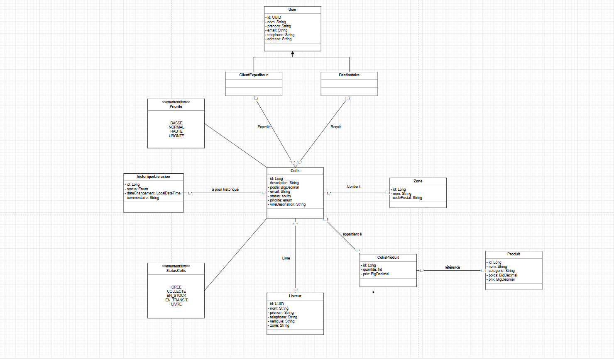

# Smart Delivery Management System (SDMS)

Smart Delivery Management System (SDMS) est une solution web complète développée pour SmartLogi, une entreprise spécialisée dans la livraison de colis à travers le Maroc.

## Table des Matières

1. [À propos](#à-propos)
2. [Fonctionnalités](#fonctionnalités)
3. [Technologies](#technologies)
4. [Prérequis](#prérequis)
5. [Installation](#installation)
6. [Architecture](#architecture)
---

## À propos

Smart Delivery Management System (SDMS) est une solution web complète développée pour SmartLogi, une entreprise spécialisée dans la livraison de colis à travers le Maroc.

### Contexte Projet

SmartLogi gère actuellement les livraisons de manière manuelle :
- Fichiers Excel et registres papier
- Erreurs de saisie fréquentes
- Pertes de données
- Retards dans les livraisons
- Manque de visibilité sur le suivi

### Objectifs

SDMS modernise et automatise la gestion logistique en :
- Centralisant les données (clients, colis, livreurs, zones)
- Fournissant une traçabilité complète en temps réel
- Optimisant la planification des tournées par zones géographiques
- Réduisant les erreurs humaines
- Facilitant la prise de décision pour les gestionnaires

---

## Fonctionnalités

### Pour le Client Expéditeur
- Créer des demandes de livraison
- Consulter la liste de ses colis en cours et livrés
- Recevoir des notifications email (collecte, livraison)
- Suivre ses envois en temps réel

### Pour le Destinataire
- Consulter le statut des colis destinés
- Voir l'historique complet de sa livraison
- Recevoir des notifications de livraison

### Pour le Livreur
- Voir la liste de ses colis assignés avec priorités
- Consulter ses zones de livraison
- Mettre à jour les statuts (collecté, en transit, livré)
- Ajouter des commentaires au fur et à mesure

### Pour le Gestionnaire Logistique
- Gestion complète CRUD (clients, colis, livreurs, destinataires)
- Voir toutes les demandes de livraison
- Assigner les colis aux livreurs et planifier les tournées
- Modifier ou supprimer des informations erronées
- Recherche avancée et filtrage (statut, zone, ville, priorité, date)
- Regrouper les données par zone, statut, priorité
- Recherche par mot-clé (nom, numéro, ville)
- Calculer poids total et nombre de colis par livreur/zone
- Identifier et alerter sur les colis en retard ou prioritaires
- Gérer les colis multi-produits
- Consulter l'historique complet avec commentaires

---

## Technologies

### Backend
| Composant | Technologie | Version |
|-----------|------------|---------|
| Langage | Java | 17+ |
| Framework | Spring Boot | 3.x |
| Web | Spring Web (REST) | 3.x |
| Data | Spring Data JPA | 3.x |
| Validation | Spring Validation | 3.x |
| Email | Spring Mail | 3.x |
| Base de données | PostgreSQL | 15+ |
| Migration DB | Liquibase | 4.x |
| Mapping | MapStruct | 1.5+ |
| Lombok | Code generation | 1.18+ |

### Documentation & Tests
| Composant | Technologie |
|-----------|------------|
| Documentation API | Swagger/OpenAPI 3.0 |
| Logging | SLF4J + Logback |
| Tests Unitaires | JUnit 5 |
| Mocking | Mockito |
| Coverage | JaCoCo |

### Build & DevOps
| Composant | Technologie |
|-----------|------------|
| Gestion dépendances | Maven 3.8+ |
| VCS | Git/GitHub |
| CI/CD | GitHub Actions (optionnel) |
| Suivi projet | Jira (optionnel) |
| Conteneurisation | Docker (optionnel) |

---

## Prérequis

### Logiciels requis

- ava JDK 17+
- java -version
- openjdk version "17.0.x" ou supérieur
- PostgreSQL 15+
- psql --version
- psql (PostgreSQL) 15.x
- Maven 3.8+
- mvn -version
- Apache Maven 3.8.x
- Git
- git --version
- git version 2.x


### IDE recommandé
- IntelliJ IDEA (Community ou Ultimate)
- Eclipse avec Spring Tools
- Visual Studio Code avec extensions Java

### Accès requis
- Accès SMTP pour l'envoi d'emails
- Accès administrateur PostgreSQL
- Accès GitHub pour cloner le repository

---

## Installation

### Cloner le Repository

**git clone https://github.com/smartlogi/sdms.git**
**cd sdms**


---

## Architecture

### Architecture en Couches


### Principes Architecturaux

- Separation of Concerns : Chaque couche a une responsabilité unique
- Dependency Injection : Gestion automatique via Spring
- DTO Pattern : Séparation Entités ↔ Transfert de données
- Exception Handling : Gestion centralisée des erreurs
- Repository Pattern : Abstraction de la persistence

## Structure du Projet


```
smartlogi-sdms/
│
├── src/
│ ├── main/
│ │ ├── java/com/smartlogi/sdms/
│ │ │ │
│ │ │ ├── SdmsApplication.java
│ │ │ │
│ │ │ ├── config/
│ │ │ │ ├── SwaggerConfig.java
│ │ │ │ ├── SecurityConfig.java
│ │ │ │ ├── MailConfig.java
│ │ │ │ └── WebConfig.java
│ │ │ │
│ │ │ ├── controller/
│ │ │ │ ├── ColisController.java
│ │ │ │ ├── LivreurController.java
│ │ │ │ ├── ZoneController.java
│ │ │ │ ├── ClientExpediteurController.java
│ │ │ │ ├── DestinataireController.java
│ │ │ │ └── StatisticsController.java
│ │ │ │
│ │ │ ├── service/
│ │ │ │ ├── ColisService.java
│ │ │ │ ├── LivreurService.java
│ │ │ │ ├── ZoneService.java
│ │ │ │ ├── ClientExpediteurService.java
│ │ │ │ ├── NotificationService.java
│ │ │ │ ├── StatisticsService.java
│ │ │ │ └── SearchService.java
│ │ │ │
│ │ │ ├── repository/
│ │ │ │ ├── ColisRepository.java
│ │ │ │ ├── LivreurRepository.java
│ │ │ │ ├── ZoneRepository.java
│ │ │ │ ├── ClientExpediteurRepository.java
│ │ │ │ ├── DestinataireRepository.java
│ │ │ │ ├── HistoriqueLivraisonRepository.java
│ │ │ │ ├── ProduitRepository.java
│ │ │ │ └── ColisProduitRepository.java
│ │ │ │
│ │ │ ├── entity/
│ │ │ │ ├── ClientExpediteur.java
│ │ │ │ ├── Destinataire.java
│ │ │ │ ├── Livreur.java
│ │ │ │ ├── Colis.java
│ │ │ │ ├── Zone.java
│ │ │ │ ├── HistoriqueLivraison.java
│ │ │ │ ├── Produit.java
│ │ │ │ └── ColisProduit.java
│ │ │ │
│ │ │ ├── dto/
│ │ │ │ ├── request/
│ │ │ │ │ ├── ColisCreateRequest.java
│ │ │ │ │ ├── ColisUpdateRequest.java
│ │ │ │ │ └── LivreurCreateRequest.java
│ │ │ │ ├── response/
│ │ │ │ │ ├── ColisResponse.java
│ │ │ │ │ ├── LivreurResponse.java
│ │ │ │ │ └── StatisticsResponse.java
│ │ │ │ └── shared/
│ │ │ │ ├── ErrorResponse.java
│ │ │ │ └── PaginationResponse.java
│ │ │ │
│ │ │ ├── mapper/
│ │ │ │ ├── ColisMapper.java
│ │ │ │ ├── LivreurMapper.java
│ │ │ │ └── ClientExpediteurMapper.java
│ │ │ │
│ │ │ ├── exception/
│ │ │ │ ├── GlobalExceptionHandler.java
│ │ │ │ ├── ResourceNotFoundException.java
│ │ │ │ ├── BusinessException.java
│ │ │ │ ├── ValidationException.java
│ │ │ │ └── ApiErrorResponse.java
│ │ │ │
│ │ │ └── util/
│ │ │ ├── ValidationUtil.java
│ │ │ ├── DateUtil.java
│ │ │ ├── PaginationUtil.java
│ │ │ └── Constants.java
│ │ │
│ │ └── resources/
│ │ ├── application.yml
│ │ ├── application-dev.yml
│ │ ├── application-test.yml
│ │ ├── application-prod.yml
│ │ ├── db/
│ │ │ └── changelog/
│ │ │ ├── db.changelog-master.xml
│ │ │ ├── 001-create-tables.xml
│ │ │ ├── 002-add-indexes.xml
│ │ │ ├── 003-add-foreign-keys.xml
│ │ │ └── 004-insert-sample-data.xml
│ │ ├── templates/
│ │ │ └── email/
│ │ │ ├── colis-collecte.html
│ │ │ ├── colis-en-transit.html
│ │ │ └── colis-livre.html
│ │ └── static/
│ │ ├── css/
│ │ └── js/
│ │
│ └── test/
│ ├── java/com/smartlogi/sdms/
│ │ ├── controller/
│ │ │ ├── ColisControllerTest.java
│ │ │ └── LivreurControllerTest.java
│ │ ├── service/
│ │ │ ├── ColisServiceTest.java
│ │ │ └── NotificationServiceTest.java
│ │ └── repository/
│ │ └── ColisRepositoryTest.java
│ └── resources/
│ └── application-test.yml
│
├── .gitignore
├── pom.xml
├── README.md
```
---

## Digrame De Class
